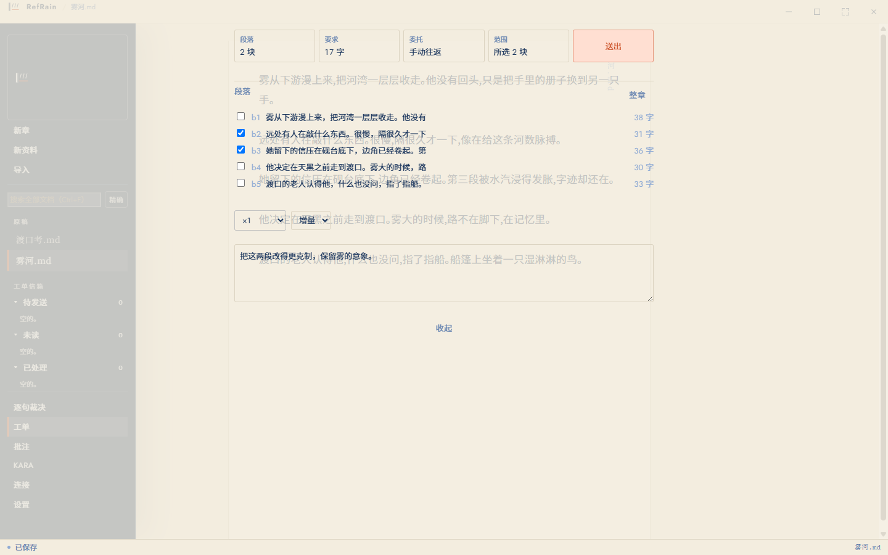
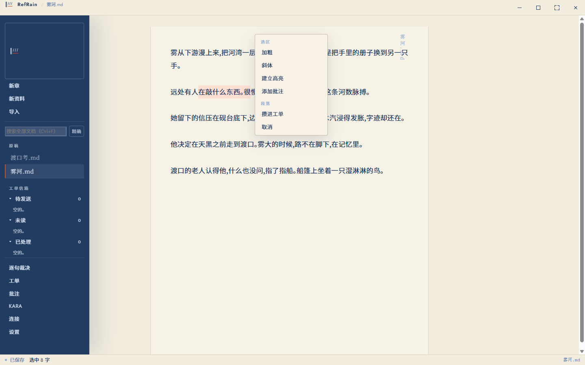
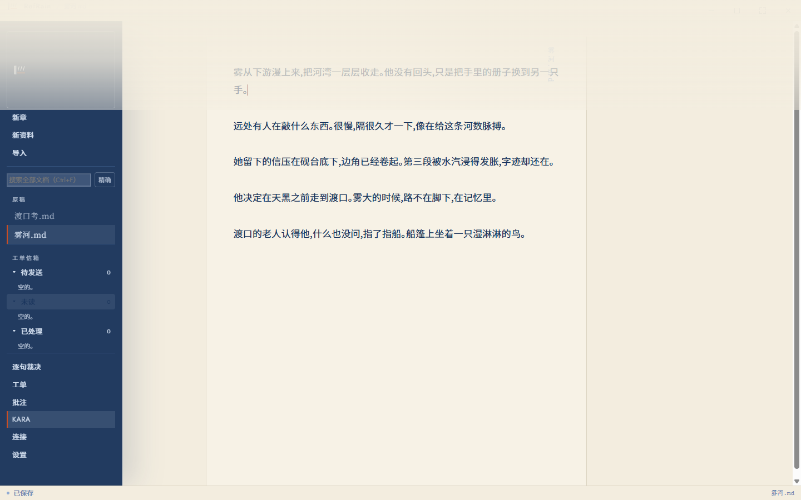

<div align="center">

# RefRain

**A local writing workbench for long manuscripts, where an agent may propose and only you may merge.**

[English](README.md) · [简体中文](README.zh-CN.md)

[](LICENSE)
[](https://github.com/kaile9/RefRain/releases/latest)

</div>

---

## The problem

An agent that edits your manuscript directly is fast and unaccountable. You end
up reading the diff to find out what happened to your own book, and the version
that made sense is somewhere behind you.

An agent that only chats is accountable and useless. You copy text out, paste it
back, and lose the thread every time.

RefRain takes the third position: **the agent proposes, you decide, and the
record of who decided what is part of the document.**

<p align="center">
  
</p>
<p align="center">
  
</p>
<p align="center">
  
</p>

## How it works

You select the passages an agent may see. RefRain freezes those exact bytes into
a request — the scopes verbatim, the context, the contract, and a digest — and
only then dispatches it.

The agent replies with replacements. RefRain checks each one against the
**frozen** request rather than against the agent's own claims, so a proposal
that no longer matches your text fails loudly instead of landing on a paragraph
the agent never read.

You accept, accept with edits, or send it back. That verdict is recorded. Only
then does your text change.

## Four things this software will not do

Each one has a gate that fails the build when it is broken:

| | |
|---|---|
| **It makes no network requests** | The application process opens no sockets. Your manuscript is on your disk and stays there. |
| **It never merges without your click** | An agent produces proposals. Nothing reaches the text without a recorded decision. |
| **It never writes your Source Backup** | `.refrain-source/` holds your files as they were when you adopted the folder. Read-only, permanently. |
| **It never deletes outright** | Removal goes to the recycle bin. |

## What you get

### Writing

The whole manuscript is one editing surface, so a selection crosses paragraphs
the way you expect. About sixty blocks are mounted at any moment out of a
possible hundred thousand, and frame scheduling follows your display's refresh
rate.

For CJK authors specifically: IME composition is never interrupted, saving waits
for `compositionend`, and three font slots (Latin, Chinese, Japanese) resolve
shared Han characters by priority rather than by accident.

Typography is under your control — weight, letter and word spacing, measure,
indent, paragraph spacing, alignment, baseline grid, display scale — with
presets for Chinese, Japanese and English, and room for your own. Fenced code is
syntax-highlighted across eight languages and six palettes, all embedded at
build time so that highlighting never reaches the network.

Markdown renders in place rather than in a preview pane beside your text.
Emphasis, strong, code and strikethrough are drawn while their markers stay
visible and dimmed, so what you see is still what is in the file. A GFM table
aligns its columns without a single space being added to the source. A
`mermaid` or `nomnoml` fence is drawn as a diagram next to its own source — and
a diagram type the renderer does not know keeps its fence and shows as text,
because a diagram that cannot be drawn must not make your words disappear.

A PDF you imported can be opened beside your manuscript and read as its own
pages, laid out the way its author set them. RefRain never writes back to that
file — the import extracts text, so a save would overwrite the original with a
partial model of it.

Smaller things that matter daily: search results that show the sentence they
matched with your query marked inside it — and clicking one puts the caret in
that block, not at the top of the file; punctuation width suggestions, empty-paragraph
cleanup, three-state inline formatting that never leaves `****` behind, headings
and quotes and lists as three-state commands, annotations that ask to be
re-anchored rather than guessing, and a failed save that tells you what to do
next.

### Working with agents

Local harnesses are discovered and connected without you knowing a path. You can
dispatch a work order straight from an annotation.

Several agents can work one round together: independent **alternates** answering
the same question, **follows** that read an upstream result, or one agent that
**verifies** another's work and may report but not propose edits.

Reference documents travel as listings rather than as text. Three 100KB
references cost about 1,250 bytes instead of 300,000, and the agent fetches what
it decides it needs — you are not paying to send an agent a library it will not
open.

Every decision lands in the **Verdict Ledger**: accepted, accepted with edits, or
sent back, sentence by sentence.

### Scale

Measured on the development machine, not estimated:

| | |
|---|---|
| 1GB Markdown | opens — 7.2 million blocks |
| 11.4MB manuscript, 100k blocks | open to JSON, p95 68ms |
| 100MB PDF import | parses in 195ms |
| 100k-file project directory | warm, p95 404ms |

## Install

Download the Windows installer from
[Releases](https://github.com/kaile9/RefRain/releases/latest). WebView2 is
installed by the bootstrapper when it is missing.

macOS and Linux are planned but not released: every measurement in this
repository comes from Linux, and nothing will be claimed for a platform until it
has been measured there.

### Building from source

Requires the Rust toolchain and [Bun](https://bun.sh):

```sh
bun install
bun x tauri build
```

Before committing, all four checks — the Rust ones are not inside `bun run gate`:

```sh
cargo fmt --all --check
cargo clippy --workspace --all-targets -- -D warnings
cargo test --workspace --all-targets
bun run gate
```

## Documentation

- [ARCHITECTURE.md](docs/ARCHITECTURE.md) — modules, glossary, and where a problem most likely lives
- [CONTRIBUTING.md](docs/CONTRIBUTING.md) — how to propose a change
- [ROADMAP.md](docs/ROADMAP.md) — what is planned (written in Chinese)
- [AGENTS.md](docs/AGENTS.md) — working discipline for agents in this repository
- [SKILL.md](docs/SKILL.md) — the agent protocol, generated from the parser

## Technology

| | |
|---|---|
| **Core** | [Rust](https://rust-lang.org) — the domain, storage, and agent orchestration |
| **Desktop shell** | [Tauri](https://tauri.app) with [WebView2](https://developer.microsoft.com/en-us/microsoft-edge/webview2/) |
| **Surface** | [SolidJS](https://solidjs.com), [TypeScript](https://www.typescriptlang.org) under `strict`, [Biome](https://biomejs.dev) |
| **Editor kernel** | Framework-free direct DOM; Rust owns the canonical bytes |
| **Storage** | [SQLite](https://sqlite.org) via [rusqlite](https://github.com/rusqlite/rusqlite); FTS5 `unicode61` with an application-level bigram tokeniser |
| **Identity** | [BLAKE3](https://github.com/BLAKE3-team/BLAKE3) digests, [UUID](https://github.com/uuid-rs/uuid) v7 |
| **Bindings** | [Serde](https://serde.rs) and [Specta](https://github.com/specta-rs/specta), which generates the TypeScript types |
| **Highlighting** | [Shiki](https://shiki.style), entry points registered precisely so nothing reaches the network |
| **Diagrams** | [nomnoml](https://github.com/skanaar/nomnoml) at 26 KB gzipped, with a translator that accepts Mermaid flowchart syntax |
| **Imported sources** | [pdf.js](https://mozilla.github.io/pdf.js/) draws an imported PDF for reading; every remote entry point is left unset, and its worker is bundled and run from a blob URL |
| **Build and release** | [Bun](https://bun.sh) and [Node.js](https://nodejs.org), build-time only; [ScriptC](https://github.com/vercel-labs/scriptc) compiles the release policy into a native executable |

Why the search index uses bigrams rather than trigrams or a tokeniser — with the
measurements that decided it — is in
[ARCHITECTURE.md](docs/ARCHITECTURE.md#why-bigram-not-trigram-or-a-tokeniser).

## Licence

[MPL 2.0](LICENSE).

## Acknowledgements

**[Shiki](https://shiki.style)** (MIT) for syntax highlighting. RefRain
registers its entry points precisely so that highlighting never reaches the
network — the library made that possible rather than fighting it.

**[nomnoml](https://github.com/skanaar/nomnoml)** (MIT, Daniel Kallin) for
diagrams. It draws a flowchart in 26 KB of pure JavaScript, with no WASM and no
request — a diagram library that could be bundled whole into an application
that never reaches the network. The nearest alternative was 36× larger.

The bundled typefaces, all under the
[SIL Open Font License 1.1](https://openfontlicense.org):

- **[Noto Sans SC](https://fonts.google.com/noto/specimen/Noto+Sans+SC)** — 20,976 Han characters plus kana, the reason a Chinese manuscript shows no tofu
- **[Zen Kaku Gothic New](https://fonts.google.com/specimen/Zen+Kaku+Gothic+New)** — 6,682 Han characters, for Japanese text
- **[Antic Didone](https://fonts.google.com/specimen/Antic+Didone)**
- **[Jost](https://indestructibletype.com/Jost.html)**
- **[Courier Prime](https://quoteunquoteapps.com/courierprime/)**

Full third-party terms are in [LICENSE-THIRD-PARTY](LICENSE-THIRD-PARTY).
