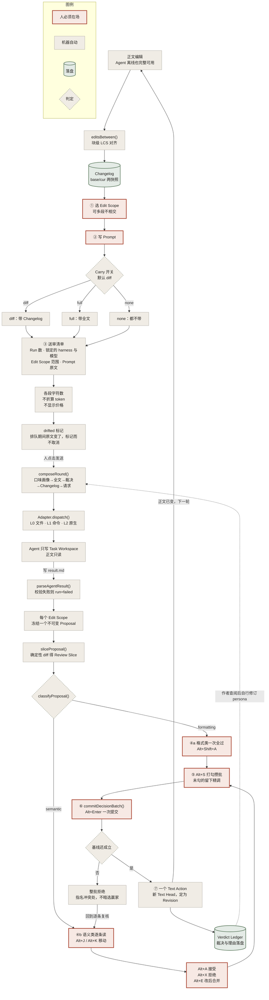
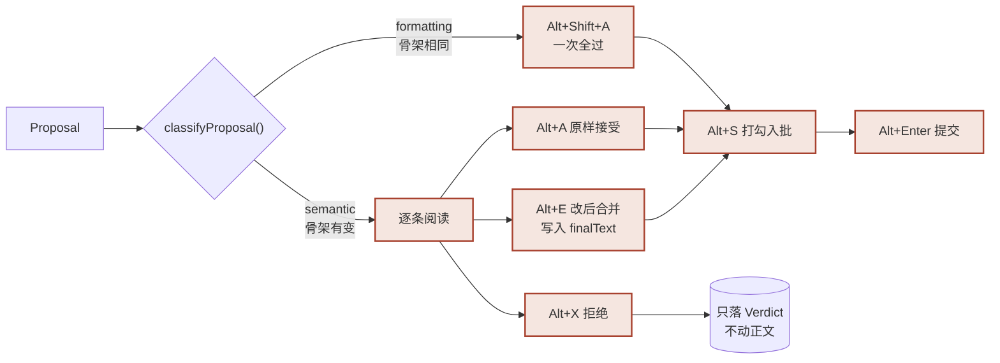

# 修改全流程

一次完整往返：作者选段 → 派发 → Agent 回稿 → 逐条裁决 → 合并 → 下一轮。

设计约束贯穿全程：**只有人点击才改正文**、**不替用户算钱**、**未知即显示未知**。

---

## 全流程



朱色框是**人必须在场**的环节，灰框是机器可自动完成的，绿框是落盘的持久物。
注意朱色框从不出现在 ⑤ 之后到 ⑥ 之前——那一段是机器的活；也从不缺席 ⑥ 与 ⑦。

---

## 一次往返里 Prompt 长什么样

顺序即缓存策略。稳定的在前，每轮变的在后。

```
<persona>                  ← 作者手写的身份，跨会话不变
  你是文字编辑。删掉不承载信息的修饰，
  保留作者的句读习惯。
</persona>

<manuscript>…</manuscript>   ← 仅 carry=full 时出现

<changes>                   ← 上一轮的裁决
  <verdict n="1" ref="s1" kind="reject">
    <reason>偏离语气</reason>
  </verdict>
</changes>

<edits>                     ← 仅 carry=diff；作者手改的部分
  <edit n="1" kind="replace">
    <before><![CDATA[…]]></before>
    <after><![CDATA[…]]></after>
    <note>补一个动作</note>
  </edit>
</edits>

<request>把第二段改得更短。</request>
```

**为什么 Changelog 放最后**：harness 按字节匹配前缀命中缓存。放在末尾，前面的口味画像与全文原样命中；插在开头，则每一轮都要按全价重读它后面的每一个 token。测试 `round-input.test.ts` 里那条「新 Changelog 不改动它之前的前缀」就是守这个性质的。

---

## Agent 回稿的格式

应用生成前两节，Agent 只填第三节——所以来源可核验，而非仅凭声称。

```markdown
# Before
<!-- scope b7 -->
（基线 Revision 处的原文）

# Request
（作者的 Prompt）

# Agent reply
<agent-result version="1">
  <replacement scope="b7">改写后的文字</replacement>
  <replacement scope="b19">另一段的改写</replacement>
  <comments>
    <comment target="b7">这里我拿不准，原文的「停」可能是有意的。</comment>
  </comments>
</agent-result>
```

一个 Run 一次提交，多个 Edit Scope 一次回来。校验失败则 `run=failed`，**不产生任何 Proposal**——提案只从已校验的工件冻结。

---

## 三档 Carry 怎么选

| 档 | 传什么 | 适合 | 代价 |
|---|---|---|---|
| **diff**（默认） | 口味画像＋裁决＋Changelog | 长期协作，Agent 已持有正文 | 增量最小，缓存命中最好 |
| **full** | 口味画像＋全文＋裁决 | 新建 Agent、刚压缩过、换 harness | 每轮重付全文 |
| **none** | 只有口味画像＋裁决 | 单 Agent 负责单段落 | Agent 不知道别处发生了什么 |

---

## 裁决路径



**分类的安全性质**：骨架比较只允许标点与空白变动，汉字、假名、拉丁字母、数字一律计入语义。「他停笔，雾散了」↔「雾散了，他停笔」每个字都在，仍判为语义——纯字符集比较会漏掉它。

漏判一个格式修正，作者多按一次键；错判一个语义修改，作者的稿子里出现他没同意过的句子。所以分类器宁可保守。

---

## 快捷键

Windows 已经占用的位，语义一致就直接复用，不另造：

| 复用 | 命令 | 理由 |
|---|---|---|
| `Ctrl+S` `Ctrl+O` `Ctrl+N` `Ctrl+F` `Ctrl+Z` `Ctrl+Y` | 保存／打开／新建／查找／撤销／重做 | 语义与系统一致 |

裁决动作一律 `Alt+`，因为检阅时正文有焦点、常有输入法候选窗开着——**裸字母键在中文写作里是字符，不是命令**：

| 键 | 动作 |
|---|---|
| `Alt+J` / `Alt+K` | 下一条／上一条 |
| `Alt+A` / `Alt+X` / `Alt+E` | 接受／拒绝／改后合并 |
| `Alt+S` | 打勾入批 |
| `Alt+Shift+A` | 本提案格式类全过 |
| `Alt+Enter` | 提交这一批 |

设置里的快捷键面板会实时报三类问题：**系统保留**（并说明系统拿它做什么）、**与本应用其他命令重复**、**裸键**。
